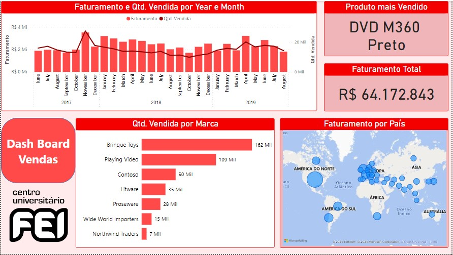

# Dashboard_Relatorio_Vendas
## 1. Problema de Negócio
Um franquia internacional de lojas de departamento, solicitou relatório das vendas realizadas entre os anos de 2017 e 2019, que possa ajudar o CEO a entender melhor o desempenho atual das lojas, auxiliando também na tomada de melhores decisões. 
- Algumas das métricas são: Faturamento, Mercas, Localização das Lojas, Lista de Produtos vendidos

## 2. Estratégia da Solução
- Planejada uma análise descritiva, entregue no formato de Dashboard como suficiente para atender ao problema de negócio.
- Foi desenvolvido um dashbord agrupando as métricas financeiras da base de dados fornecida pelo setor.

### 2.1 Imagem do Dashboard

## 3. Tecnologias usadas
- **Excel:** Recebimento da base de dados original;
- **Power BI:** Tratamento de dados, construção de tabelas métricas e dashboard.

## 4. Como executar o projeto
- Acesse o arquivo "Relatorio_Vendas.pbix";
- Utilize os filtros e gráfico interativos para visualização das métricas.

## 5. Top 3 Insights de dados
- Os Estados Unidos da América é o país com maior participação no faturamento da empresa, no perído analisado, superando o faturamento dos continentes: América do Sul, Ásia, África e Oceania juntos
- Em todos os meses de 2019, a marca com maior quantidade de produtos vendida foi a "Brinquedo Toys".
- O mês de maior faturamento da empresa foi em Novemrbo de 2017, onde a marca "Brinqueto Toys" atingiu sua máxima de produtos vendidos, sendo 15 mil .

## 6. Próximos Passos
1. Automatização do dashboard após novo recebimento de dados.
